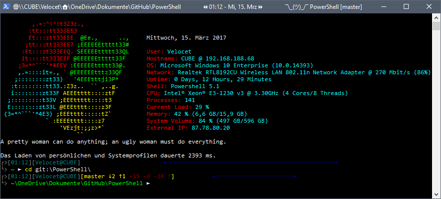

<a id="markdown-[Velocet's PowerShell Repository [](../releases/) [](../LICENSE)](#velocets-powershell-repository-github-releasehttpimgshieldsiogithubreleasevelocetdotfilessvgmaxage2592000releases-licensehttpimgshieldsiogithublicensevelocetdotfilessvgmaxage2592000license)" name="[Velocet's PowerShell Repository [](../releases/) [](../LICENSE)](#velocets-powershell-repository-github-releasehttpimgshieldsiogithubreleasevelocetdotfilessvgmaxage2592000releases-licensehttpimgshieldsiogithublicensevelocetdotfilessvgmaxage2592000license)"></a>
# Velocet's PowerShell Repository [](../releases/) [](../LICENSE)

[](../issues/)
[](../pulls/)

**vPoShRepo** is a collection of personal PoSh scripts for use in PoSh, ISE, NuGet, etc to be easily adopted by others and made to run instantly on any PC you take your script collection to.

<p align="center"></p>

<a id="markdown-[**Download**](#download)" name="[**Download**](#download)"></a>
## **Download**

* :package: [Version 2.0.1](../releases/)
* :octocat: [Source Code](../archive/master.zip)

<a id="markdown-[**Features**](#features)" name="[**Features**](#features)"></a>
## **Features**

* Punkt 1
* Pinkt 2..

---

<a id="markdown-[TODO](#todo)" name="[TODO](#todo)"></a>
## TODO

* Motd einarbeiten:
  * Fortune Cookie Online: http://www.thebuttonfactory.nl/?p=3127
  * Fortune Cookie Offline:
  * https://anjaz.ch/2015/08/24/motd-for-powershell-using-the-fortune-mod-linux-package-files/
  * Fortune Cookie RSS: http://www.harleystagner.com/uncategorized/powershell-rss-powered-message-of-the-day.php
* http://winaero.com/blog/how-to-clear-all-event-logs-in-windows-10/
* https://github.com/FuzzySecurity/PowerShell-Suite/tree/master/Bypass-UAC

---

<!-- TOC -->
- [Getting Started](#getting-started)
  - [Pre-Requirements](#pre-requirements)
    - [Dependencies](#dependencies)
  - [Installation](#installation)
    - [Method 1 (recommended)](#method-1-recommended)
    - [Method 2](#method-2)
- [Documentation](#documentation)
  - [Usage](#usage)
    - [Examples](#examples)
  - [Deployment](#deployment)
  - [Development](#development)
  - [Contributing](#contributing)
    - [Versioning](#versioning)
- [About](#about)
  - [Author & Contact](#author--contact)
  - [Contributors](#contributors)
  - [Third-party libraries](#third-party-libraries)
  - [Acknowledgments & Notes](#acknowledgments--notes)
  - [Release History / Change-log](#release-history--change-log)
    - [:heavy_check_mark: To-Do](#heavy_check_mark-to-do)
  - [Built With](#built-with)
- [:page_facing_up: License](#page_facing_up-license)

<!-- /TOC -->

---

<a id="markdown-[Getting Started](#getting-started)" name="[Getting Started](#getting-started)"></a>
## Getting Started

These instructions will get the project up and running on your local machine.

<a id="markdown-[Pre-Requirements](#pre-requirements)" name="[Pre-Requirements](#pre-requirements)"></a>
### Pre-Requirements

To get the best experience you should use cmder as your main shell instead of the normal PowerShell terminal. Combined with the oh-my-posh module you will make your terminal way more powerful!

* Execution Policy set to *Bypass* or *Unrestricted*
  * Get the current execution policy: `Get-ExecutionPolicy`
  * Set the current execution policy to *Unrestricted*: `Set-ExecutionPolicy Unrestricted`
    * Note: You need a elevated PoSh terminal
* Modules
  * [PSReadLine](<https://github.com/lzybkr/PSReadLine>)
  * [PoSh-Git](https://dahlbyk.github.io/posh-git/)
  * [PSColorful](https://github.com/Davlind/PSColor) (_optional_)


<a id="markdown-[Dependencies](#dependencies)" name="[Dependencies](#dependencies)"></a>
#### Dependencies

No dependencies as of now.

<a id="markdown-[Installation](#installation)" name="[Installation](#installation)"></a>
### Installation

<a id="markdown-[Method 1 (recommended)](#method-1-recommended)" name="[Method 1 (recommended)](#method-1-recommended)"></a>
#### Method 1 (recommended)

* Open an elevated PoSh prompt:

  ```PowerShell
  iwr http://raw.githubusercontent.com/Velocet/PowerShell/master/install.ps1 -UseBasicParsing | iex
  ```
  This will download, extract and install everything automatically into your PoSh profile folder.

  Find your profile directory:
  ```PowerShell
  Split-Path $PROFILE
  ```

<a id="markdown-[Method 2](#method-2)" name="[Method 2](#method-2)"></a>
#### Method 2
* Open an elevated PoSh prompt.

* Download the [latest version](../archive/master.zip):
  ```PowerShell
  # Downloads the latest version to the current directory
  iwr https://github.com/Velocet/PowerShell/archive/master.zip -OutFile master.zip
  ```

* Extract it the archive to a folder named after your username:
  ```PowerShell
  Expand-Archive master.zip $env:USERNAME
  ```

* Move the extracted folder to your PoSh profile folder:
  ```PowerShell
  mv $env:USERNAME $(Split-Path $PROFILE)
  ```

* To load the profile everytime we open a new prompt we only have to execute this last line:
  ```PowerShell
  # Replace '$env:USERNAME' if you have used another name for the folder
  Add-Content $PROFILE '`n. $env:USERNAME\profile.ps1'
  ```
  **Note**: If you used another name instead of *$env:USERNAME* you have to adjust the commands.

---

<a id="markdown-[Documentation](#documentation)" name="[Documentation](#documentation)"></a>
## Documentation

The idea of this PoSh repo is to have all your files inside one folder which could reside anywhere on the local machine. The best way would be to keep it on OneDrive or another cloud provider to have all your scripts right by your hand.

<a id="markdown-[Usage](#usage)" name="[Usage](#usage)"></a>
### Usage

This PoSh script repo should be at least invasive as it could be. This is why you only have to add one line to your *profile.ps1* file.

If you want to replace your profile files completly with the files of this repo you could just overwrite them. This is the main reason why the three files in the repo are named like the original files but are residing inside a seperate directory.

After adding the line which loads the repo to your $PROFILE ..

<a id="markdown-[Examples](#examples)" name="[Examples](#examples)"></a>
#### Examples

Examples showing how to use the application

```PowerShell
Write-Host 'Hello World!'
```

<a id="markdown-[Deployment](#deployment)" name="[Deployment](#deployment)"></a>
### Deployment

Add additional notes about how to deploy this on a live system

<a id="markdown-[Development](#development)" name="[Development](#development)"></a>
### Development

Always stick to the official [Cmdlet Development Guidelines](https://msdn.microsoft.com/en-us/library/ms714657(v=vs.85).aspx) and coding guidelines provided by ISESteroids (which are based on [The PowerShell Best Practices and Style Guide](https://github.com/PoshCode/PowerShellPracticeAndStyle)).

---

<a id="markdown-[Contributing](#contributing)" name="[Contributing](#contributing)"></a>
## Contributing

1. Fork it!
1. Create your feature branch: `git checkout -b my-new-feature`
1. Commit your changes: `git commit -am 'Add some feature'`
1. Push to the branch: `git push origin my-new-feature`
1. Submit a pull request :)

<a id="markdown-[Versioning](#versioning)" name="[Versioning](#versioning)"></a>
### Versioning

I use [SemVer](http://semver.org/) for versioning. For available versions, see the [tags](../tags).

---

<a id="markdown-[About](#about)" name="[About](#about)"></a>
## About

This project started as tool base to help me with common task i encounter on different PCs. Since i have to deal with many different computers and accounts i needed a fast and single folder solution which could be downloaded instantly.

<a id="markdown-[Author & Contact](#author--contact)" name="[Author & Contact](#author--contact)"></a>
### Author & Contact

* **Felix Niederhausen** - [Homepage / E-Mail](https://velocet.de/)
* Twitter: [@velocet](https://twitter.com/velocet/ "Velocet on twitter")
* PowerShell Gallery: [Velocet's Profile](https://www.powershellgallery.com/profiles/Velocet/)

<a id="markdown-[Contributors](#contributors)" name="[Contributors](#contributors)"></a>
### Contributors

See also the list of [contributors](../contributors/) who participated in this project.

<a id="markdown-[Third-party libraries](#third-party-libraries)" name="[Third-party libraries](#third-party-libraries)"></a>
### Third-party libraries

[ISESteroids](http://www.powertheshell.com/isesteroids/) from Dr. Tobias Weltner

<a id="markdown-[Acknowledgments & Notes](#acknowledgments--notes)" name="[Acknowledgments & Notes](#acknowledgments--notes)"></a>
### Acknowledgments & Notes

* Thanks to [M. Miller](https://github.com/mmillar-bolis/ps-motd) for the initial `Get-MotD` version

<a id="markdown-[Release History / Change-log](#release-history--change-log)" name="[Release History / Change-log](#release-history--change-log)"></a>
### Release History / Change-log

For a change-log please see the [releases page](../releases/).

<a id="markdown-[:heavy_check_mark: To-Do](#heavy_check_mark-to-do)" name="[:heavy_check_mark: To-Do](#heavy_check_mark-to-do)"></a>
#### :heavy_check_mark: To-Do

* :small_red_triangle: MotD überarbeiten...
* :small_orange_diamond: Priority 2
* :small_red_triangle_down: Priority 3

<a id="markdown-[Built With](#built-with)" name="[Built With](#built-with)"></a>
### Built With

* [ISESteroids](www.powertheshell.com/isesteroids/)
* [Visual Studio Code](https://code.visualstudio.com/)
* Icons by [The Noun Project](https://thenounproject.com/)
* Badges by [Shields.io](http://shields.io/)

---

<a id="markdown-[:page_facing_up: License](#page_facing_up-license)" name="[:page_facing_up: License](#page_facing_up-license)"></a>
## :page_facing_up: License

This project is licensed under the *MIT License* - see the [LICENSE](LICENSE.md) file for details.

The documentation of this project is licensed under the [GNU Free Documentation License](https://www.gnu.org/licenses/fdl-1.3.en.html).
